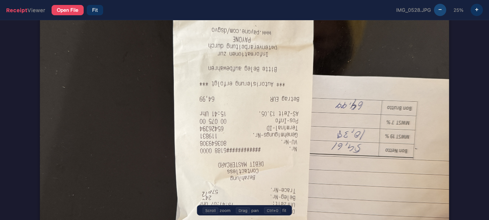

# Receipt Viewer 🧾

A **zero-dependency, single-file** HTML image viewer optimized for receipt/document scans. Drop an image and instantly zoom, pan, and inspect details.



## Features

- **One file** — no build tools, no servers, no npm. Open `index.html` in your browser.
- **Drag & drop** — or click "Open File" to load images.
- **Smooth zoom** — mouse scroll wheel, `+`/`−` buttons, or <kbd>Ctrl+</kbd>/<kbd>Ctrl−</kbd>.
- **Smart zoom** — zooms toward the cursor position, not the center.
- **Pan** — click and drag the image when zoomed in.
- **Fit to screen** — one click or <kbd>Ctrl+0</kbd>Ctrl+0<kbd>.</kbd>
- **Clean dark UI** — easy on the eyes for long review sessions.
-format documents.
- **Keyboard shortcuts** — <kbd>Ctrl+</kbd> zoom in, <kbd>Ctrl−</kbd> zoom out, <kbd>Ctrl+0</kbd> fit.

## Browser Support

Works in any modern browser (Chrome, Firefox, Safari, Edge). No dependencies, no polyfills needed.

## Usage

```bash
# Just open the file in your browser
open index.html
```

Or serve it locally (optional):

```bash
python3 -m http.server 8000
# → http://localhost:8000
```

## Why?

Built for the [German-OCR pipeline](https://hermes-agent.nousresearch.com) — processing hundreds of receipt scans needed a fast, focused viewer. Works for any document image.

## Tech

Vanilla HTML5 + CSS3 + JavaScript. Zero frameworks, zero build steps.

## License

MIT
